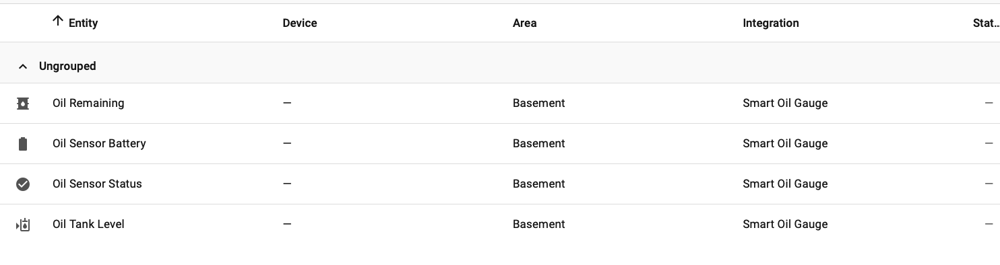

I created this integration because I've owned a Smart Oil Gauge for years and wanted it's data in Home Assistant.
Over the years there were some scraper options for some data but I didn't really care for that.
If you find this useful, great, I don't want any donations, just say Thanks :)
I've been testing this integration this winter, went thru a few versions working out any bugs, is stable as of the latest HA release.
Drop this custom integration into your directory and Enjoy :)

Since I use this now, if any issues crop up or changes in Home Assistant, let me know and I'll update this component ASAP

Add my REPO to HACS, https://github.com/cmptrblder/smart_oil_gauge

## Screenshots

### Integration Setup

### Entities

# Smart Oil Gauge – Home Assistant Integration

Unofficial Home Assistant integration for Smart Oil Gauge oil tank monitors.

This integration allows Home Assistant to retrieve and display oil tank
information from your Smart Oil Gauge account using a secure, UI-based setup.

---

## Features

- UI-based configuration (no YAML required)
- Oil level percentage
- Gallons remaining
- Sensor battery status
- Sensor operational status
- Stable entity IDs
- Cloud polling (30-minute interval)

---

## Installation (HACS)

1. Open **HACS**
2. Go to **Integrations**
3. Click **Custom repositories**
4. Add:
5. Category: **Integration**
6. Install **Smart Oil Gauge**
7. Restart Home Assistant

---

## Configuration

1. Go to **Settings → Devices & Services**
2. Click **Add Integration**
3. Search for **Smart Oil Gauge**
4. Enter your Smart Oil Gauge username/email and password

---

## Entities Created

| Entity Name | Description |
|------------|-------------|
| Oil Remaining | Gallons remaining in the oil tank |
| Oil Tank Level | Percentage of tank capacity |
| Oil Sensor Battery | Battery condition |
| Oil Sensor Status | Operational status |

---

## Screenshots

### Integration Setup

### Entities

---

## Notes

- This integration uses web authentication and may be affected by upstream changes.
- Credentials are stored securely by Home Assistant.
- Polling interval is fixed to limit request frequency and avoid account issues.

---

## Support

Issues and feature requests can be submitted via GitHub Issues.
